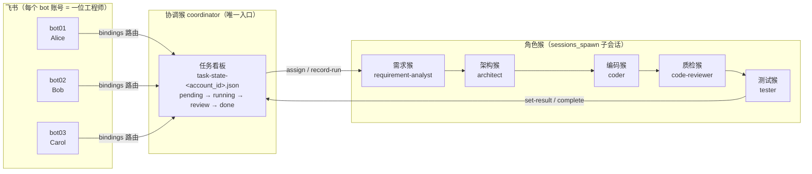
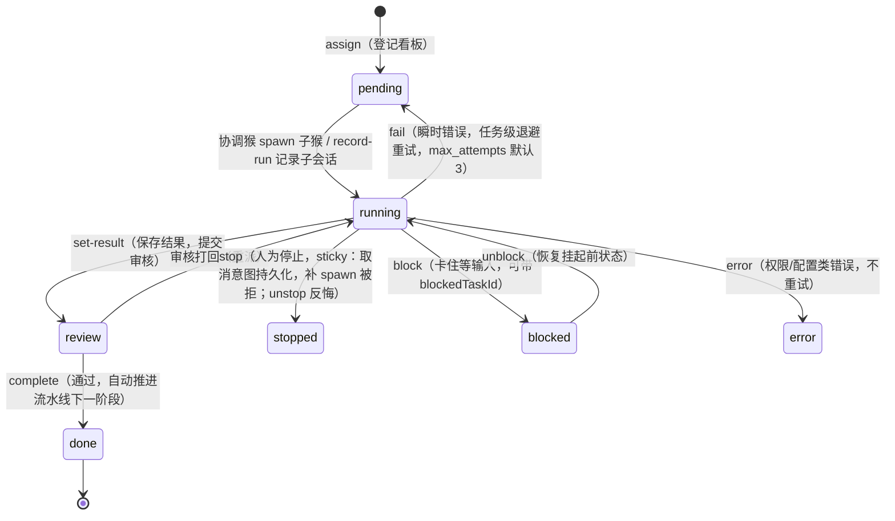

# 架构说明

> 一句话：**账号即工程师，看板即状态机，协调猴派活，五猴流水线干活。**

## 全景图

要点：

- **账号即工程师**：`channels.feishu.accounts` 里每个飞书 bot 账号对应一位工程师，经 `bindings` 全部路由到 coordinator。工程师之间互不可见——各自独立看板、独立状态文件、独立凭证；
- **看板即状态机**：每位工程师一块看板，状态全部落盘在 `task-state-<account_id>.json`；
- **五猴流水线**：`agents.list` 定义 coordinator + 需求 / 架构 / 编码 / 质检 / 测试五只角色猴，协调猴用 `sessions_spawn(agentId=...)` 拉起子会话干活。

## 任务状态机

状态语义：

| 状态 | 含义 |
|---|---|
| `pending` | 已登记看板，等待派活 |
| `running` | 某只角色猴正在干（已记录子会话） |
| `review` | 干完了，结果已保存，等审核 |
| `done` | 审核通过；若是流水线阶段任务，自动推进下一阶段 |
| `stopped` | 人为停止；**sticky cancel**：取消意图持久化（`cancel_requested`+时间戳，重启不丢），补 spawn（retry-due 拉起 / record-run 登记）被拒并提示 unstop；`unstop` 清除意图反悔恢复 |
| `blocked` | 卡住等输入（等用户确认/等上游产物），与 `error` 明确区分：不是失败、不烧 attempts；`blockedTaskId` 记来源上游任务；`unblock` 恢复流转 |
| `error` | 权限/配置类失败，**不自动重试** |
| `pending`（经 fail） | 瞬时错误，按 `max_attempts` 退避重试 |

## 派活闭环

一次完整的干活闭环由协调猴驱动：

1. **`assign <agent_id> <标题>`** —— 在看板上登记任务（`pending`），指定干活的猴子；
2. **`sessions_spawn(agentId=...)`** —— 协调猴拉起角色猴子会话开始干活；
3. **`record-run <task_id> [run_id] [child_session_key]`** —— 把子会话记录挂到任务上（`running`），看板即可追踪"谁在干"；
4. **`set-result <task_id> <结果> [摘要]`** —— 子猴交付，保存结果并转 `review`；
5. **`complete <task_id>`** —— 审核通过置 `done`；若该任务属于五猴流水线的一个阶段，`complete` 会自动创建并启动下一阶段任务（需求 → 架构 → 编码 → 质检 → 测试）。

失败路径：`fail`（瞬时，任务级重试）与 `error`（配置类，不重试）分开处理，是重试纪律的关键。

## 配置分层

- **OpenClaw 层**（`openclaw.json`，模板见仓库根 [`openclaw.example.json`](../openclaw.example.json)）：飞书多账号、agent 定义、两处白名单、bindings 路由；
  - ⚠️ `subagents.allowAgents`（coordinator 条目内）与 `tools.agentToAgent.allow` 是两道独立闸门，**每新增一只猴两处都要同步加**，这是最易踩的坑；
- **业务层**（本仓库 `config/`）：`team.json` 定义工程师/昵称/open_id/默认账号，`accounts/*.json` 存 per-account 飞书凭证；代码缺失配置时退化到内置默认值，详见 `config/README.md`。

## 验证

`tests/smoke_test.py` 用虚构 team.json + mock 卡片发送，离线跑通 `board / assign / set-result / complete` 状态机闭环（不发真实飞书消息），由 `.github/workflows/smoke.yml` 在 push/PR 时自动执行。
